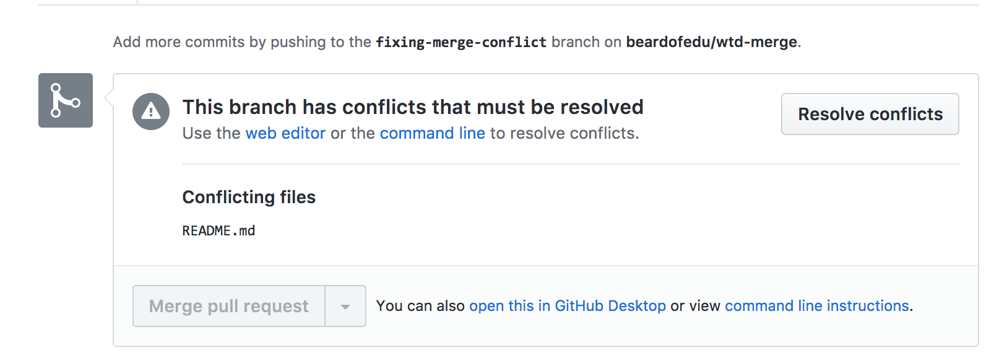
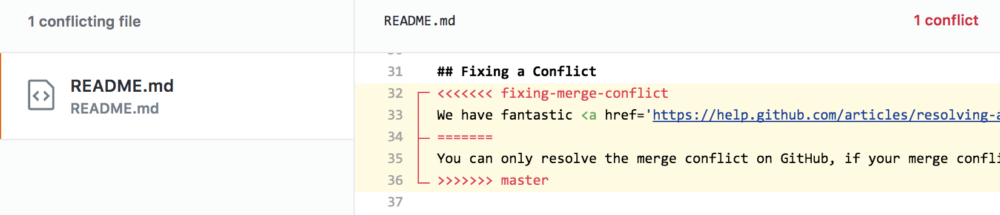
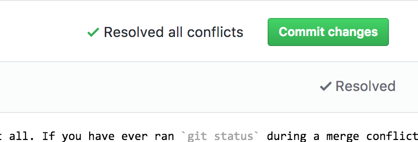

# Merge Conflicts Aren't Scary 

[Visualization Tool](http://git-school.github.io/visualizing-git/)

## Why is this happening to me?

Merge conflicts occur when two people are working on the same part of the same file because Git doesn't know which version is correct. This is an **awesome** opportunity for you to collaborate with another writer on your team to identify the best way to proceed. 

## Don't Fear the Conflict
Does `<<<<< 02383434` give you nightmares? You are not alone. But don't worry unlike scrimishes with your family on holidays merge conflicts are not hard to fix.

Take a deep breath we are going to help you learn to identify what git is telling you, how to fix the issue and how to bend git to your desired state.

## Reading a Conflict Message in the Terminal

## Identifying a Merge Conflict in your Document

So, lets look at this image and identify what it is telling us:

- `<<<<<<< HEAD`
  So, HEAD, is a pointer, that points to a **branch**, a **branch** points to the latest commit. So, HEAD is currently pointing to the latest commit in the `stats-update` branch.
- `=======`
  This is a seperator between the conflict that is occuring between the two branches.
- ` >>>>>>>>> gh-pages` or `>>>>>>>>>>>>>>>>>>>> a1f045`
  This is the branch that you are currently trying to merge into your branch that is causing the merge conflict to occur. This can sometimes display a random assortment of alphanumerical characters. This is in fact the SHA-1 hash associated with a commit and your computer **is not** breaking. 

## Aborting a Merge
Sometimes you may not want to deal with a merge conflict at all. If you have ever ran `git status` during a merge conflict you may have seen this line, `(use "git merge --abort" to abort the merge)`. Running `git merge --abort` undoes everything that the merge attempted to do and places you back into the state your project was in prior to the atempted merge.

## Fixing a Conflict
You can only resolve the merge conflict on GitHub, if your merge conflict is caused by competing line changes, such as when people make different changes to the same line of the same file on different branches in your Git repository. For all other merge conflicts, you must resolve the merge conflict locally on the command line.
We have fantastic <a href='https://help.github.com/articles/resolving-a-merge-conflict-using-the-command-line/' target='_blank'>merge conflict resolution steps in our help docs</a>.

## Merge Conflicts on a Pull Request
If you create a pr in Github, it may alert you to a merge conflict in the GUI.

There are tools in Github for resolving some, but not all merge conflicts. These tools closely mimic what happens on the command line tools.

First we identify the conflicts and resolve them.

Mark the new implementation as resolved.

Commit the changes.

Know that this exists as it can be handy, but don't be afraid to do this on the command line as some times it is your only path forward.

## Exercise 
The repository for example merge conflicts can be found here: https://github.com/beardofedu/wtd-games

### Simple Merge Conflict
1. Fork the `wtd-games` repo from https://github.com/beardofedu/wtd-games
1. Clone the project locally.
1. `cd` into the repository and checkout the **stats-update** branch using: `git checkout stats-update`
1. Run `git merge gh-pages` and you will encounter a merge conflict.
1. Open the **index.html** file in your favorite text editor. 
1. Lines **14-18** will have a merge conflict.
1. Select which color you want the score to be and remove the excess code. You should be left with a single line of code that looks like this: `#score    { color: yellow; font-weight: bold; vertical-align: middle; }`
1. In the command line, enter `git add index.html`
1. In the command line, enter `git coommit` 
1. Celebrate your victory over the merge conflict!

### Advanced Merge Conflict
This exercise is going to use a new **remote** to pull changes from another repository.

1. First we need to create a new remote, enter: `git remote add upstream https://github.com/beardofedu/wtd-games`
1. In the command line, enter: `git fetch upstream`
1. In the command line, enter: `git checkout -b shape-colors origin/shape-colors`
1. In the command line, enter: `git merge upstream/shape-colors`, this will cause a merge conflict to occur, look for the merge conflict markers, pick the colors you want to use in the game, and save your work.
1. In the command line, enter: `git add index.html`
1. In the command line, enter: `git commit`
