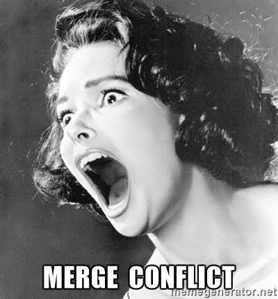
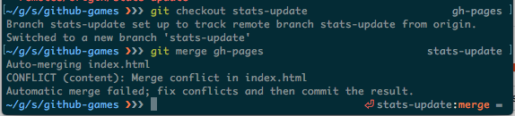
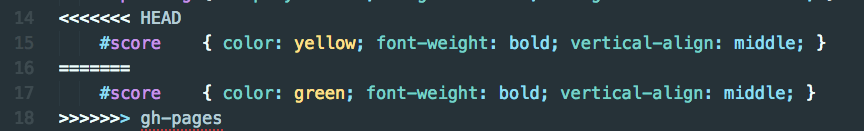

# Merge Conflicts Aren't Scary 

## Why is this happening to me?

Merge conflicts occur when two people are working on the same part of the same file because Git doesn't know which version is correct. This is an **awesome** opportunity for you to collaborate with another writer on your team to identify the best way to proceed. 

## Don't Fear the Conflict
Does `<<<<< 02383434` give you nightmares? You are not alone. But don't worry unlike scrimishes with your family on holidays merge conflicts are not hard to fix.

Take a deep breath we are going to help you learn to identify what git is telling you, how to fix the issue and how to bend git to your desired state.

## Reading a Conflict Message in the Terminal

## Identifying a Merge Conflict in your Document

## Aborting a Merge

## Fixing a Conflict

## Merge Conflicts on a Pull Request
